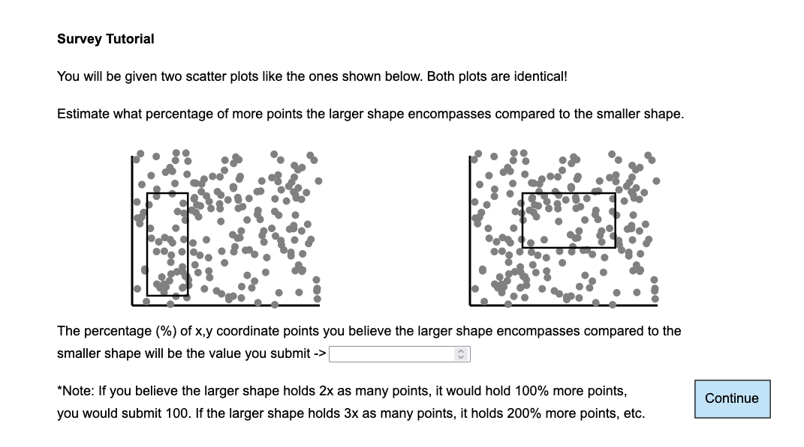
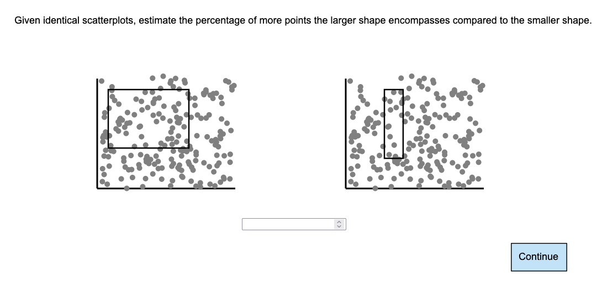
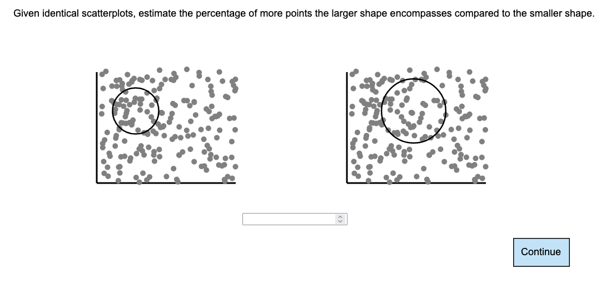
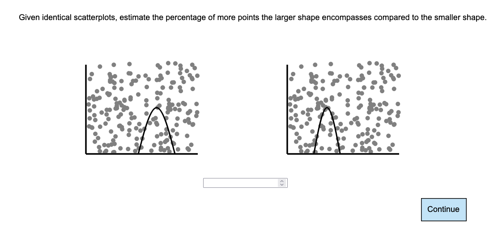
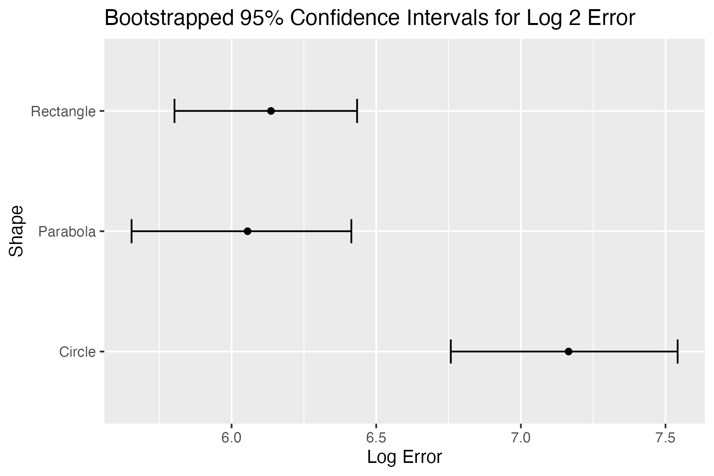

Assignment 3 - Replicating a Classic Experiment
===
Students: Sarah Olson

Link to deployed survey: https://sarah-olson-a3-study.glitch.me/

The Study
---
For this assignment, I designed my own study. This study was inspired by the original Cleveland and McGill experiment, though instead of comparing participants’ ability to judge size difference in different chart types, I was comparing participants’ ability to judge the difference in point encapsulation of different shapes for scatter plots.

I created my own custom survey to complete this experiment using d3. This is a full stack app of sorts, as there is an Express.js and MongoDB backend (where all of the data is stored). The survey has an introduction page, a tutorial page, 15 randomly assigned experiment questions, and an end page letting the participant know they have completed the survey.

For each experiment question, the shape used for comparison is randomly selected from one of the three following shapes: circles, rectangles, or parabolas. The participant will be shown 2 identical scatterplots with one of the previously mentioned shapes drawn on each scatterplot, encapsulating a random amount of points. Each participant must, using their best guess at a glance, estimate the percentage of more points the larger shape encompasses compared to the smaller shape on the scatterplot.

Examples of experiment questions using each shape are shown below:

Rectangles

Circles

Parabolas

In each visualization the participant sees, both the points in the scatterplot and the size of the shapes encompassing the points are random. The base x and y values for both circles and rectangles is fixed, though the exact value is different for circles and rectangles. For rectangles, the width and height of both shapes are randomized and for circles, the radius is randomized. For parabolas, the x,y coordinate point used for the vertex is randomized, the two points which meet with the x axis are +/- the maximum distance between either edge of the plot * .5 (so this value is fixed with respect to the random vertex).

A correct difference in the percentage of points encapsulated is calculated for each visualization and stored along with the participants guesses in the database. This way, a proper “correct” answer can be used for calculating the error.

I pulled the data from MongoDB using `mongoexport` to create a CSV. This CSV was also used for implementing error scoring and creating all plots in R.

Results
---

The average log 2 errors for each shape are as follows:
- parabola: 6.055
- rectangle: 6.136
- circle: 7.165

It is clear that, while the average errors for parabolas and rectangles was similar, both shapes are far less error prone than circles. 

These values for log 2 errors for all shapes are quite high, especially relative to the original experiment. This indicates that this task, judging the percentage more points encapsulated by the larger shape compared to the smaller shape, was much harder for individuals compared to the original experiment. Despite this, a similar trend is seen as in the original experiments: individuals struggle more with identifying the percentage difference in shapes such as circles compared to rectangles. 

It is also interesting to note that the parabola had the lowest error value of the three. This indicates that participants’ guesses were closest to the actual percentage with parabolas compared to other shapes. This is possibly due to more limitations that were set on the parabola during the randomization and generation in terms of size, which may have limited the variety in size differences relative to rectangles and circles. This could also indicate that participants were able to make more accurate guesses because of more familiarity with the shape in this context. Parabolas are usually introduced and exclusively used in graph-based settings, while participants may be less familiar with completing the same task as accurately with shapes like rectangles and circles because they are put in a setting (the graph) which they are not as familiar seeing the shape in. 

Design Achievements
---
### Designed my own study
For this assignment, I designed my own study. In the spirit of Cleveland and McGill, I wanted to explore which shape encapsulations participants were more accurate with in determining the percentage more points the larger shape encompassed compared to the smaller. First, I chose to compare rectangles and circles because they are familiar shapes and participants have probably experienced comparing the sizes of each shape with respect to each other (participants are probably more likely to have compared a large rectangle and a smaller rectangle compared to a large octagon and a smaller octagon). I chose circles as opposed to another straight edged shape, like a triangle, because I wanted to see if comparing shapes which are curved or comparing shapes with sharp and concrete lines helps or hurts participants’ ability to judge differences in the size and percentage of points inside the shape. As I needed 3 visualization types to compare, I chose parabolas because I felt like the shape was more of a middle ground between circles and rectangles. Though its shape relies on curves, I felt that most of the time it's easier to determine how much larger a parabola is over another parabola as opposed to a circle. I also thought it would be interesting to put a shape like a parabola, a shape which most participants would have been introduced to in a math setting, on a graph to see if the familiarity of the setting of the shape may impact the results at all. 

### Designed my own survey platform
In designing the actual UI for the survey platform, I wanted to keep it as simple and straightforward as possible. Especially because comparing the shapes and points inside them requires more cognitive load than some other tasks, I wanted to minimize distractions so that participants could put most of their energy toward the task. With the exception of the continue button, the entire study is in grayscale, again to limit cognitive load but also to minimize any perceptual cueing effects. It is worth noting that the points on the graph and the shape which is drawn are different colors. The points are gray and the shape is black. This was done to make the points easier to see and to make the shapes more distinct and visible to participants. Additionally, there is only one box for participants to write their answer and one button which submits the response and moves them onto the next task. This button, the continue button, is a light blue color. There is only one button which moves the participant forward, not backward, to ensure that the participants can focus on their task and not edit any answers retroactively. This was done to minimize any effects of double comparison (i.e. a participant enters 100 but upon seeing the next question, they realize their previous answer should have been 50). I also made sure that there was a tutorial page which mirrors the actual experimental pages as close as possible, just with extra instructions and explanations. I added in the note about how percentages work in the context of a study like this after trialing myself and realizing my numbers were off because of my initial lack of understanding about how something like 2x more points translates into 100% more points. 

Technical Achievements
---
### Implemented my own custom survey platform with d3 front end
For this assignment, I implemented my own frontend for my custom survey. To do this, I used d3 to create virtually all the front end elements. This includes the graphs, buttons, and text on each survey page. The only element which was not created in d3 was the input box where participants enter their answer. This element is just the standard html `input`. This was done to make it easier to perform server related tasks, such as pulling the answer and sending it to the backend. 

### Completely randomized surveys
Almost every element of the experimental part of the survey was randomized. This includes the graph generation, including each of the 200 points in the scatterplots and size of the shapes which were laid on top of the scatterplots. The question type, essentially the type of shape that appeared on the graph, was also randomized. The only element which was not randomized was the location of the rectangles and circles; the location of parabolas were randomized. The location for these shape types were fixed, though there is slight variation in the location of circles compared to rectangles. 

### Client side calculation of expected percent difference
I also fully automated and implemented the calculation for the expected percent difference. This number is essentially “what percentage more points DID the larger shape encompass compared to the smaller shape”. For rectangles, this was quite straight forward, especially since I saved all the scatterplot points to an array. But for circles and parabolas, this became infinitely more challenging. For circles, I had to recall that I could use the distance formula to find the distance between the point and the center of the circle and compare that to the radius to determine if the point was in the bounds of the circle. For parabolas, I needed to do quite a bit of research and figuring out equations that would work with my domain. In the end, I found a sort of point-slope equation which I could use to determine if a point was in the bounds of the parabola, which ended up working well. But, it took longer than I would have intended to figure the calculations of parabolas out. This is also why each parabola is a frown shape (in math terms, it means the leading coefficient is negative). This was done so that it was easier to make functions that create the parabolas and calculate the expected percent difference.

### Implemented my own custom survey platform with Express.js + MongoDB Backend
In addition to the frontend, I implemented a fully functional backend for this assignment. For my survey platform, I used an Express.js server with a MongoDB database. I chose to use MongoDB because of its NoSQL nature. It was easier and quicker for me to set up the database that I wanted. As I have used both MongoDB and Express.js before (albeit almost 1.5 years ago), I was able to get my backend set up quicker than using different tools. Though admittedly, setting up servers is not as easy to pick up again as riding a bike. I also knew that MongoDB had capabilities such as `mongoexport`, which I knew would make pulling data from the database for analysis much quicker.

GitHub Details
---
d3_surver : folder with all the code used for the front-end/server of the survey

results_py : folder with all the code used for data preprocessing and analysis. The csv with all the raw results is `survey_results.csv`

img : folder with all the images used in this README
